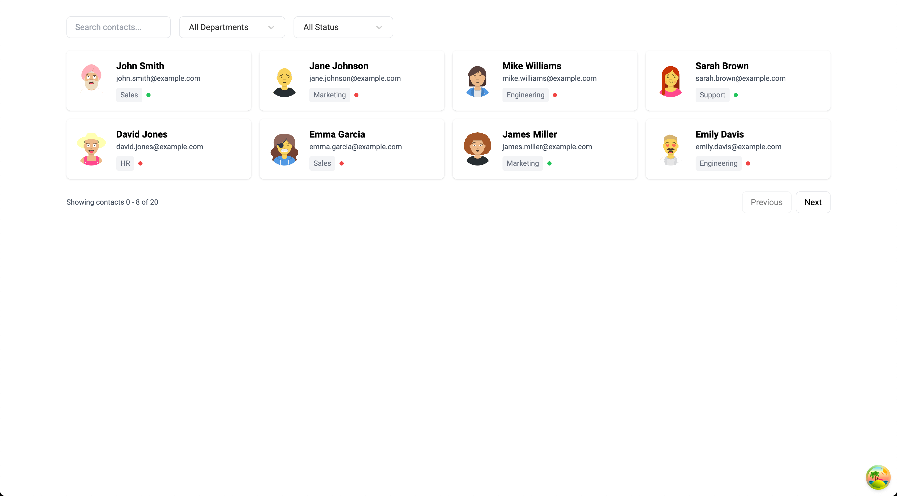
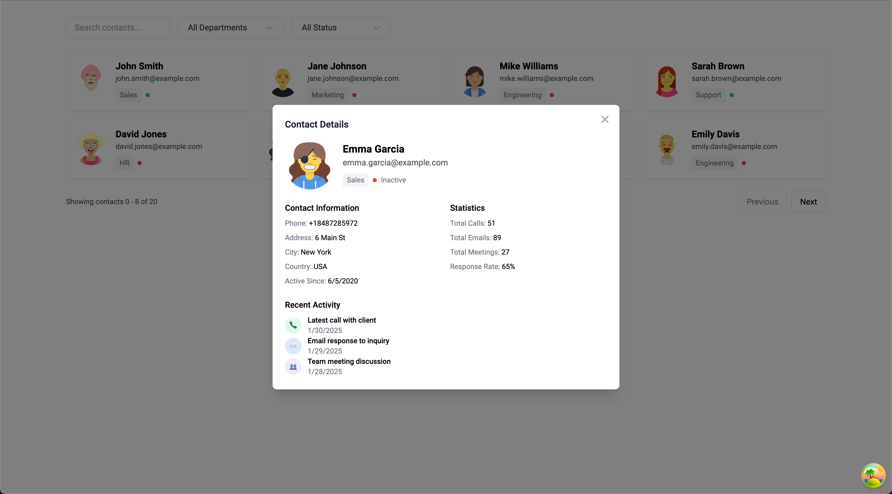

# Frontend Developer Code Challenge (2-3 hours)

## Overview

Create a contacts dashboard using React, TypeScript, and Tanstack Query. The application should display a paginated list of business contacts with basic filtering capabilities.

_Use the `src/modules/contacts` folder for your implementation._

## Getting Started

1. Clone this repository
2. Install dependencies with `yarn install`
3. Run the development server with `yarn dev`

## Tech Stack

This boilerplate comes with:

- React + TypeScript
- Vite for build tooling
- TanStack Query (React Query) for data fetching
- Tailwind CSS for styling
- ESLint + Prettier for code formatting

## Provided APIs

The challenge comes with two mock API endpoints in `src/modules/api/getContacts.ts`:

### 1. Get Contacts

```typescript
const response = await getContacts({
  page: 1, // Current page (default: 1)
  limit: 5, // Items per page (default: 5)
  search: 'john', // Search in name/email (optional)
  department: 'Sales', // Filter by department (optional)
  isActive: true, // Filter by status (optional)
});

// Response type:
interface ContactsResponse {
  contacts: Contact[];
  pagination: {
    total: number; // Total number of results
    page: number; // Current page
    limit: number; // Items per page
    totalPages: number; // Total number of pages
  };
}

// Contact type:
interface Contact {
  id: number;
  name: string;
  email: string;
  phone: string;
  address: string;
  city: string;
  country: string;
  department: string;
  isActive: boolean;
  avatarUrl: string;
  activeSinceDate: string;
  recentActivity: Activity[];
  statistics: ContactStatistics;
}
```

### 2. Get Contacts Count

```typescript
const count = await getContactsCount({
  search: 'john', // Search in name/email (optional)
  department: 'Sales', // Filter by department (optional)
  isActive: true, // Filter by status (optional)
});
```

The mock data includes 40 contacts with:

- Basic details (name, email, phone, address)
- Department (Sales, Marketing, Engineering, Support, HR)
- Status (active/inactive)
- Avatar image (via DiceBear API)
- Recent activity (last 3 activities)
- Contact statistics

## Requirements

### 1. Contact List View (45 minutes)



Create a responsive grid of contact cards showing:

- Avatar thumbnail
- Full name
- Email
- Department
- Status indicator

Implement filters:

- Search input for name/email - make sure the data updates as the user types but don't make a request on every keystroke
- Department select
- Status toggle

Add pagination:

- Previous/Next buttons
- Currently shown results text
- Total results count

### 2. Data Fetching (45 minutes)

- Use TanStack Query's `useQueries` hook to _fetch both contacts and total count simultaneously_
- Combine the results to show accurate pagination info
- Handle loading states for both queries
- Handle error states for both queries
- Implement proper caching

### 3. Contact Details Modal (30 minutes)



When clicking a card, show a modal with:

- Large avatar
- All contact information
- Recent activity list
- Basic statistics

### 4. Polish (45 minutes)

- Loading states (e.g. skeletons)
- Error messages
- Empty states

## Evaluation Criteria

2. **Core Functionality (50%)**

   - Working pagination
   - Proper error handling
   - Smooth interactions

3. **Code Quality (40%)**

   - Clean, maintainable code
   - Proper TypeScript usage
   - Component organization

4. **UI/UX (10%)**
   - Professional design
   - Loading states
   - Responsive layout

## Bonus Points

- Mobile responsiveness
- Loading animations
- Basic unit tests

## Submission

1. Create a branch with your name
2. Implement the features
3. Create a pull request

## Time Guide

- Setup: 15 minutes
- List view & filters: 45 minutes
- Data fetching: 45 minutes
- Details modal: 30 minutes
- Polish: 45 minutes

Total: 3 hours

## Tips

- Focus on core functionality first
- Use Tailwind CSS for quick styling
- Leverage React Query's built-in loading/error states
- Keep components small and focused
- Use TypeScript effectively for type safety

Good luck!
